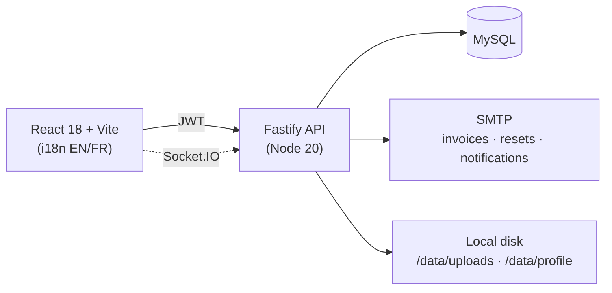

# Clear Aligner Production CRM

[](https://github.com/Chadoud/clear-aligner-production-crm/actions/workflows/ci.yml)


**CRM template for clear-aligner production labs.** Put case intake, treatment follow-up, doctor collaboration, quotations, invoicing, and consolidated doctor billing in one place — instead of email and spreadsheets.

“Production” in the product name means the **lab manufacturing workflow**, not a hosted SaaS instance of this repo.

**Two roles, one shared record.** Labs (`company` role) manage production, pricing, and billing; doctors submit cases and follow their patients. Both collaborate on the same case — status, documents, and discussion stay in sync.

> Evaluable starter under an All-rights-reserved license: you may run it locally to evaluate. Product use needs written permission — see [License](#license).

## Contents

- [Product demos](#product-demos)
- [What it covers](#what-it-covers)
- [How it works](#how-it-works)
- [Design decisions](#design-decisions)
- [Quick start](#quick-start)
- [Common commands](#common-commands)
- [Security](#security)
- [Documentation](#documentation)
- [License](#license)

## Product demos

After `npm run db:setup`, walk these paths as `lab@example.com` (seed supports each surface):

| Demo            | Seed path                                                                                                        |
| --------------- | ---------------------------------------------------------------------------------------------------------------- |
| Dashboard       | `/app` — cases DEMO-1001…1005                                                                                    |
| Invoicing       | Case **Jordan Martin** → Create invoice → treatment presets (`/app/company/case-management/id/1001?tab=invoice`) |
| Doctors billing | `/app/company/doctors-billing/all` — open invoice **INV-DEMO-1003** + paid **INV-DEMO-1005**                     |
| Stripping       | Case **Taylor Bernard** (DEMO-1002) — checkbox + v2 stubs                                                        |

**Dashboard** — every active case, its follow-up status, and revenue at a glance. Filters and statuses mirror how a lab actually triages the day.


**Invoicing** — a case becomes a quote, then an invoice with a Swiss QR-bill payment block, previewed as PDF and emailed the same day.


**Doctors billing** — instead of chasing invoices one by one, the lab rolls a doctor's open invoices into a single consolidated bill with payment reminders.


**Stripping plans** — digitized interproximal reduction (IPR) plans, so dentists read treatment steps in the CRM instead of on paper.


<details>
<summary>Earlier iteration of the stripping plans (V1) — before the UX pass</summary>
<br />

</details>

## What it covers

| Area               | Capabilities                                                      |
| ------------------ | ----------------------------------------------------------------- |
| **Cases**          | Intake, case sheets, status follow-up, documents                  |
| **Quotations**     | Dual service catalogs (Lab / Direct), presets, treatment pricing  |
| **Invoicing**      | Quotes → invoices, PDF preview, Swiss QR-bill style payment block |
| **Doctor billing** | Batch bills and payment reminders                                 |
| **Collaboration**  | Lab ↔ doctor discussion (realtime when configured)                |
| **Access**         | Lab (`company`) and doctor roles, JWT auth                        |

The two **catalogs** reflect two sales channels: **Lab** prices work billed to partner clinics, **Direct** prices work billed straight to walk-in patients. Payment QR images and organisation details ship as **placeholders** — swap them before any live use ([docs/BRANDING.md](docs/BRANDING.md)).

## How it works



| Layer    | Tech                                                          |
| -------- | ------------------------------------------------------------- |
| Frontend | React 18, Vite, React Router, i18next                         |
| Backend  | Node 20, Fastify, MySQL, JWT                                  |
| Shared   | `@aligner-crm/domain` (pricing / service rules)               |
| Realtime | Socket.IO (optional discussion / mobile bridge)               |
| Quality  | ESLint, TypeScript, Vitest, Playwright, Husky, GitHub Actions |

```
src/               React application
backend/           Fastify API
backend/db/        Owned schema + demo seed
packages/domain/   Shared pricing & service rules
docs/              Architecture, API, security, branding
e2e/               Playwright smoke tests
scripts/           Local helpers (diagnose, GIF encode, MySQL tunnel)
scripts/ops/       Optional private VPS deploy helpers
```

## Design decisions

- **App-owned SQL under `backend/db/`** — versioned schema + anonymized seed; no external dump required to evaluate.
- **Raw SQL (`mysql2`), not an ORM** — explicit queries keep every read/write auditable against a known table layout.
- **Shared `packages/domain` for pricing** — UI preview and API finalization use the same rules, so the quote total always matches the invoice.
- **JWT for humans, machine keys for jobs** — short-lived role-scoped tokens for the UI; separate secrets for cron / server-to-server. bcrypt only.
- **Dual auth rate limits** — login and password-reset are capped per IP _and_ per email (or reset token). Production binds default to `127.0.0.1` (`LISTEN_HOST`) behind a trusted proxy (`TRUST_PROXY`).

## Quick start

**Requirements:** Node 20+, Docker (for MySQL + Mailpit).

```bash
docker compose up -d
cp .env.example .env
cp backend/.env.example backend/.env
npm install
cd backend && npm install && cd ..
npm run db:setup
npm run dev:all
```

| App     | URL                                                |
| ------- | -------------------------------------------------- |
| UI      | http://localhost:3000                              |
| API     | http://localhost:4000 (`/health`, `/health/ready`) |
| Mailpit | http://localhost:8025                              |

**Demo logins** (from seed — these are the only accounts that exist locally):

| Email                | Password     | Role   |
| -------------------- | ------------ | ------ |
| `lab@example.com`    | `Doctor123!` | Lab    |
| `doctor@example.com` | `Doctor123!` | Doctor |

Seed includes two cabinets, several patients/cases (open, beware, delivered), chat/suivi rows, case-doc metadata, and sample quotes plus a paid invoice (`DEMO-1005`). Enough to walk the main GIF paths without inventing data.

In local dev the login screen shows these credentials and can fill them for you. Production emails from another CRM will return **Invalid email or password**.

Branding placeholders live under `public/assets/brand/` — swap before a real deploy ([docs/BRANDING.md](docs/BRANDING.md)).

If you already ran an older seed, refresh data with:

```bash
npm run db:reset
```

Then hard-refresh the browser (or clear site data for `localhost:3000`) so a stale session is not kept.

<details>
<summary>Connecting to a remote MySQL over SSH instead of Compose?</summary>

```bash
export SSH_USER=…
export SSH_HOST=…
export REMOTE_HOST=…   # MySQL host as seen from the SSH server
bash scripts/mysql-tunnel.sh
# then point SOURCE_DB_URL at the tunnel port
```

More in [docs/MYSQL_TUNNEL.md](docs/MYSQL_TUNNEL.md).

</details>

Env reference: [backend/.env.example](backend/.env.example) · Schema notes: [backend/db/README.md](backend/db/README.md)

## Common commands

```bash
npm run dev            # frontend only
npm run dev:backend    # API only
npm run dev:all        # both, concurrently

npm run db:setup       # apply schema + demo seed
npm run db:reset       # drop/recreate DB, then setup

npm run build          # production frontend build
npm run lint           # ESLint
npm run typecheck      # TypeScript
npm run test:run       # unit tests (Vitest)
npm run test:e2e       # Playwright smoke (needs MySQL + seed; also CI `e2e-smoke`)

cd backend && npm run build && npm run test:run   # API build + tests
```

CI runs frontend/backend quality, `db-template` (schema + seed login/smoke), and `e2e-smoke` (login → cases → cabinets).

`scripts/ops/` is optional private VPS helpers — not part of local evaluation.

## Security

- Secrets only in environment variables — never commit `.env`
- Passwords: **bcrypt only**
- Case documents served by this API (`/data/uploads/...`)
- API: JWT Bearer; optional machine keys for cron / mobile / server-to-server
- Helmet, CORS, rate limiting (global + dual IP/email on auth); roles enforced server-side

Details: [docs/SECURITY.md](docs/SECURITY.md) · Reporting: [.github/SECURITY.md](.github/SECURITY.md)

## Documentation

Start at [docs/README.md](docs/README.md).

| Doc                                     | Purpose                 |
| --------------------------------------- | ----------------------- |
| [ARCHITECTURE.md](docs/ARCHITECTURE.md) | System map & boundaries |
| [API.md](docs/API.md)                   | How UI and API talk     |
| [SECURITY.md](docs/SECURITY.md)         | Auth & secrets          |
| [BRANDING.md](docs/BRANDING.md)         | Logos, names, contacts  |
| [DEPLOYMENT.md](docs/DEPLOYMENT.md)     | Private deploy notes    |
| [CONTRIBUTING.md](docs/CONTRIBUTING.md) | PR & quality gates      |

**Deploy in short:** CI green on `main` → `npm run build` (front) + `cd backend && npm run build` → ship `dist/` + backend artifact → set production env → verify `/health` and login. Full notes: [docs/DEPLOYMENT.md](docs/DEPLOYMENT.md). Optional VPS helpers live under [scripts/ops/](scripts/ops/).

## License

© Chadoud. All rights reserved. This repository is an **evaluable CRM template** for clear-aligner production labs.

You may view the source and run it locally. You may **not** copy, modify, redistribute, sublicense, or use it in a product without written permission from the rights holder. See [LICENSE](LICENSE).
