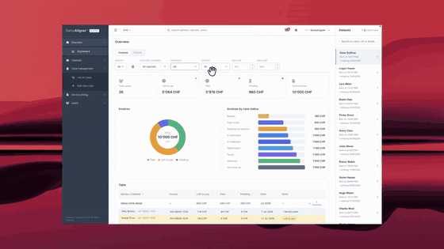
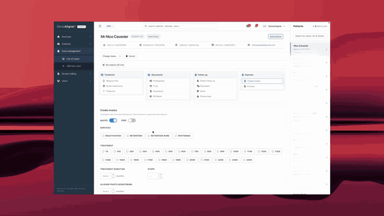
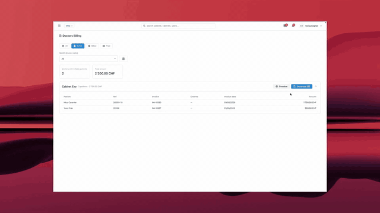
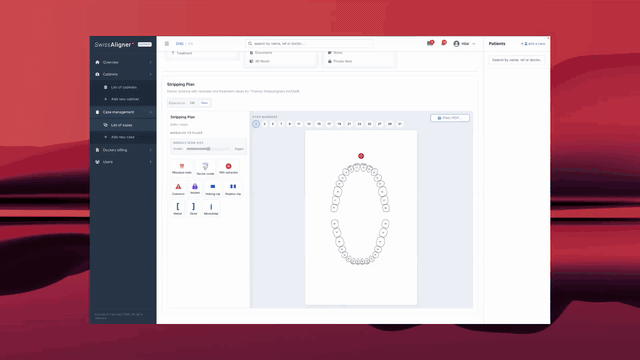
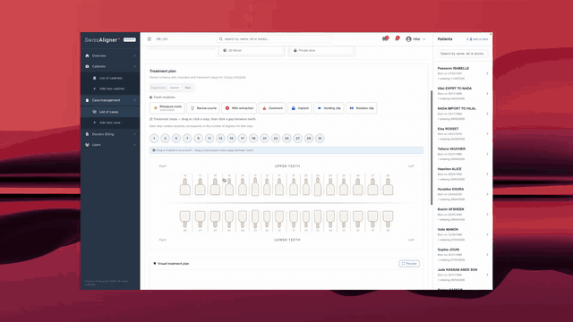
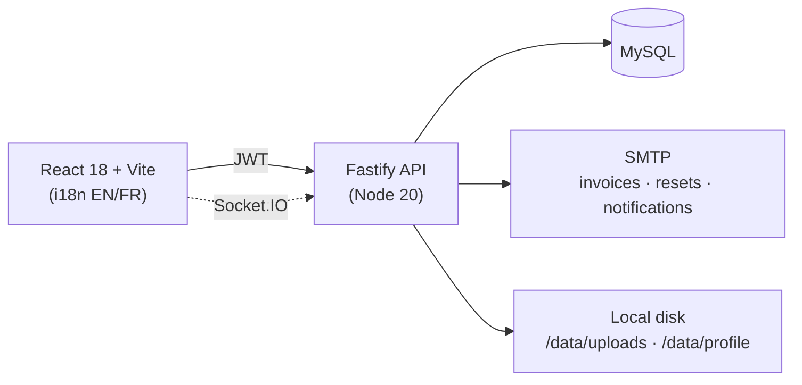

# Clear Aligner Production CRM

[](https://github.com/Chadoud/clear-aligner-production-crm/actions/workflows/ci.yml)


Aligner labs juggle cases, doctor communication, quotes, and billing across email and spreadsheets. This CRM puts the whole production workflow in one place: a dentist submits a case, the lab tracks treatment steps and documents, and a quote becomes an emailed invoice in a few clicks — with consolidated doctor billing at the end of the month.

**Two roles, one shared record.** Labs (`company` role) manage production, pricing, and billing; doctors submit cases and follow their patients. Both collaborate on the same case — status, documents, and discussion stay in sync.

> This is a **sanitized public reference** of a clear-aligner lab CRM — real architecture and CI quality gates, with client branding, secrets, and patient data removed. “Production” in the product name means the **lab manufacturing workflow**, not a live hosted instance of this repo. See [License](#license) for usage terms.

## Contents

- [Product demos](#product-demos)
- [What it covers](#what-it-covers)
- [How it works](#how-it-works)
- [Design decisions](#design-decisions)
- [Quick start](#quick-start)
- [Common commands](#common-commands)
- [Security](#security)
- [Documentation](#documentation)
- [Notes for reviewers](#notes-for-reviewers)
- [License](#license)

## Product demos

**Dashboard** — every active case, its follow-up status, and revenue at a glance. Filters and statuses mirror how a lab actually triages the day.



**Invoicing** — a case becomes a quote, then an invoice with a Swiss QR-bill payment block, previewed as PDF and emailed the same day.



**Doctors billing** — instead of chasing invoices one by one, the lab rolls a doctor's open invoices into a single consolidated bill with payment reminders.



**Stripping plans** — digitized interproximal reduction (IPR) plans, so dentists read treatment steps in the CRM instead of on paper.



<details>
<summary>Earlier iteration of the stripping plans (V1) — before the UX pass</summary>
<br />

</details>

## What it covers

| Area               | Capabilities                                                      |
| ------------------ | ----------------------------------------------------------------- |
| **Cases**          | Intake, case sheets, status follow-up, documents                  |
| **Quotations**     | Dual service catalogs (Lab / Direct), presets, treatment pricing  |
| **Invoicing**      | Quotes → invoices, PDF preview, Swiss QR-bill style payment block |
| **Doctor billing** | Batch bills and payment reminders                                 |
| **Collaboration**  | Lab ↔ doctor discussion (realtime when configured)                |
| **Access**         | Lab (`company`) and doctor roles, JWT auth                        |

The two **catalogs** reflect two sales channels: **Lab** prices work billed to partner clinics, **Direct** prices work billed straight to walk-in patients. Payment QR images and organisation details ship as **placeholders** — swap them in a private deployment before any live use.

## How it works



| Layer    | Tech                                                          |
| -------- | ------------------------------------------------------------- |
| Frontend | React 18, Vite, React Router, i18next                         |
| Backend  | Node 20, Fastify, MySQL, JWT                                  |
| Shared   | `@aligner-crm/domain` (pricing / service rules)               |
| Realtime | Socket.IO (optional discussion / mobile bridge)               |
| Quality  | ESLint, TypeScript, Vitest, Playwright, Husky, GitHub Actions |

```
src/               React application
backend/           Fastify API
packages/domain/   Shared pricing & service rules
docs/              Architecture, API, security, deploy
e2e/               Playwright smoke tests
scripts/           Local helpers (MySQL tunnel, deploy, demo GIFs)
```

## Design decisions

- **Raw SQL (`mysql2`), not an ORM** — the CRM sits on a shared legacy MySQL schema it does not own; explicit queries keep every read/write auditable.
- **Shared `packages/domain` for pricing** — UI preview and API finalization use the same rules, so the quote total always matches the invoice.
- **JWT for humans, machine keys for jobs** — short-lived role-scoped tokens for the UI; separate secrets for cron / server-to-server. bcrypt only — no legacy password paths.
- **Dual auth rate limits** — login and password-reset are capped per IP _and_ per email (or reset token), so spray and credential-stuffing are both throttled.

## Quick start

**Requirements:** Node 20+ and a MySQL database you manage yourself — this template ships **without demo data** (empty schema or a private anonymised dump both work).

**1. Install**

```bash
npm install
cd backend && npm install && cd ..
```

**2. Configure environment**

```bash
cp .env.example .env                    # frontend
cp backend/.env.example backend/.env    # backend
```

Only three values need editing for local development:

| File           | Key                 | Why                                     |
| -------------- | ------------------- | --------------------------------------- |
| `backend/.env` | `SOURCE_DB_URL`     | Points the API at your MySQL            |
| `backend/.env` | `JWT_SECRET`        | Signs login tokens — long random string |
| `.env`         | `VITE_USE_API=true` | UI loads data from the API (uncomment)  |

Everything else (CORS origin, ports, log level) ships with working local defaults.

**3. Run**

```bash
npm run dev:all
```

| App | URL                                                |
| --- | -------------------------------------------------- |
| UI  | http://localhost:3000                              |
| API | http://localhost:4000 (`/health`, `/health/ready`) |

<details>
<summary>MySQL is only reachable over SSH?</summary>

```bash
export SSH_USER=…
export SSH_HOST=…
export REMOTE_HOST=…   # MySQL host as seen from the SSH server
bash scripts/mysql-tunnel.sh
```

More in [docs/MYSQL_TUNNEL.md](docs/MYSQL_TUNNEL.md).

</details>

Env reference: [backend/.env.example](backend/.env.example)

## Common commands

```bash
npm run dev            # frontend only
npm run dev:backend    # API only
npm run dev:all        # both, concurrently

npm run build          # production frontend build
npm run lint           # ESLint
npm run typecheck      # TypeScript
npm run test:run       # unit tests (Vitest)
npm run test:e2e       # Playwright smoke tests (local; not in CI)

cd backend && npm run build && npm run test:run   # API build + tests
```

## Security

- Secrets only in environment variables — never commit `.env`
- Passwords: **bcrypt only**
- Case documents served by this API (`/data/uploads/...`)
- API: JWT Bearer; optional machine keys for cron / mobile / server-to-server
- Helmet, CORS, rate limiting (global + dual IP/email on auth); roles enforced server-side

Details: [docs/SECURITY.md](docs/SECURITY.md) · Reporting: [.github/SECURITY.md](.github/SECURITY.md)

The security contact in `.github/SECURITY.md` is a **placeholder** (`security@example.com`) — replace it with your company’s address before relying on it.

## Documentation

Start at [docs/README.md](docs/README.md).

| Doc                                     | Purpose                 |
| --------------------------------------- | ----------------------- |
| [ARCHITECTURE.md](docs/ARCHITECTURE.md) | System map & boundaries |
| [API.md](docs/API.md)                   | How UI and API talk     |
| [SECURITY.md](docs/SECURITY.md)         | Auth & secrets          |
| [DEPLOYMENT.md](docs/DEPLOYMENT.md)     | Ship checklist          |
| [CONTRIBUTING.md](docs/CONTRIBUTING.md) | PR & quality gates      |

**Deploy in short:** CI green on `main` → `npm run build` (front) + `cd backend && npm run build` → ship `dist/` + backend artifact → set production env → verify `/health` and login. Full notes: [docs/DEPLOYMENT.md](docs/DEPLOYMENT.md).

## Notes for reviewers

- **Why no seed data?** A realistic dump would contain patient data, so this template ships without one. Data loading, document conventions, and API shapes are documented under [docs/](docs/).
- **What was sanitized?** Client branding, hosts, secrets, ops/migration scripts, and legacy integrations were removed; auth is bcrypt-only and documents are served locally by the API.
- **Demo media** — the GIFs above are re-encoded screen recordings (`bash scripts/encode-readme-gifs.sh`).

## License

© All rights reserved. This repository is published as a **sanitized public reference**.

You may view the source. You may **not** copy, modify, redistribute, sublicense, or use it in a product without written permission from the rights holder. See [LICENSE](LICENSE).
